# Prompt Gallery — Architecture & Build Spec

**Status:** Draft v1 — based on live inspection of `YouMind-OpenLab/awesome-gpt-image-2/README.md` on 2026-06-20
**Goal:** A self-updating, server-less prompt+image gallery, deployed on GitHub Pages, sourced from one or more "awesome-*-prompts" markdown repos.

---

## 0. What the source data actually looks like (this matters a lot)

Before designing anything, I fetched the real README. A few facts change the design meaningfully:

1. **It's huge and growing fast.** Stats block in the README reports `Total Prompts: 10695`, and the first ~30 entries already span just June 19–20, 2026 — this repo is gaining **roughly 20–40 new prompts per day**. Any "refetch and reparse the whole file every run" design will get more expensive every week. The ETL must be incremental by design, not just in theory.

2. **Entry numbers are not stable IDs.** Every entry is `### No. 7: Profile / Avatar - <Title>`, but `No. 7` today is `No. 6` tomorrow once a new prompt is inserted at the top (list is sorted newest-first). The **only stable identifier** is the numeric `id` query param in the `[👉 Try it now →](https://youmind.com/gpt-image-2-prompts?id=26257)` link. **Everything must key off that, never off the `No. N` rank.**

3. **Category lives inside the title string, not as its own field**, and only in the "All Prompts" section:
   `### No. 1: Profile / Avatar - Luxury Lobby Denim Jumpsuit Portrait`
   → category = `Profile / Avatar`, title = `Luxury Lobby Denim Jumpsuit Portrait`.
   In the "Featured Prompts" section the same prompt appears **without** the category prefix. Splitting naively on the first `" - "` is unsafe because titles themselves sometimes contain a hyphen-like separator. The safe approach: maintain the fixed category taxonomy (scraped once from the "🏷️ Browse by Category" section — ~31 known labels), and only treat the prefix as a category if it exactly matches a known label.

4. **Images are raw HTML, not markdown image syntax.** Each image is:
   ```html
   <div align="center">
   
   </div>
   ```
   When `remark-parse` parses this, it produces an mdast node of type **`html`** containing that whole blob as a raw string — **not** an `image` node. A parser that walks the tree looking for `node.type === 'image'` will silently find **zero images**. You must regex/HTML-parse the raw `html` node bodies instead.

5. **The prompt body is a fenced code block**, immediately after a `#### 📝 Prompt` heading — sometimes JSON-shaped (`{ "type": ..., "style": ... }`), sometimes plain prose. Both are valid; store the raw text and a `promptFormat: "json" | "text"` flag (try `JSON.parse`, fall back to `"text"`).

6. **Many prompts use Raycast Snippet syntax** for fill-in-the-blank fields:
   `{argument name="background color" default="soft purple and blue gradient"}`
   This is a genuine feature opportunity (a "remix this prompt" form), not just noise — worth extracting into a structured `templateArguments[]` array.

7. **The "Details" block is a markdown bullet list** (`- **Author:** [...](...)`, `- **Source:** ...`, `- **Published:** ...`, `- **Languages:** ...`) directly below `#### 📌 Details` — clean to parse as a list, not free text.

8. **The repo's own README updates via its own GitHub Action** (`update-readme.yml` badge visible at the top) on its own schedule. We don't control or depend on that timing — we just poll on ours.

9. **License is CC BY 4.0** (badge in header) — this is good news: it explicitly permits redistribution with attribution, which is exactly what this project does. Keep the existing per-prompt Author/Source attribution intact and credit the upstream repo on the site.

Everything below is designed around these eight facts, not around a generic "markdown to JSON" assumption.

---

## 1. High-level architecture

```mermaid
flowchart LR
    subgraph Sources["External source repos (community-maintained)"]
        S1["awesome-gpt-image-2\nREADME.md"]
        S2["awesome-seedance-2-prompts\nREADME.md"]
        S3["future tool repo..."]
    end

    subgraph ETL["Our repo — ETL pipeline (GitHub Actions, scheduled)"]
        A["shallow git clone\nper source"] --> B["Markdown to mdast\n(remark/unified)"]
        B --> C["Source Adapter\nextract raw fields"]
        C --> D["Normalize + Zod validate\n-> NormalizedPrompt"]
        D --> E["Diff vs existing data\nby stable externalId"]
        E --> F["Write chunked JSON\n+ rebuild search index"]
        F --> G["git commit data/**\n(only if changed)"]
    end

    subgraph Build["Build & deploy (GitHub Actions, on push)"]
        H["Next.js, output: export"] --> I["generateStaticParams\nreads data/** at build time"]
        I --> J["Static HTML per prompt\n+ listing pages + sitemap"]
        J --> K["actions/deploy-pages"]
    end

    subgraph Site["GitHub Pages — 100% static, no server"]
        L["Prerendered detail pages\n(real HTML, SEO-friendly)"]
        M["Client-side hydration:\nsearch, filters, infinite scroll"]
    end

    S1 --> A
    S2 --> A
    S3 --> A
    G --> H
    K --> L
    K --> M
```



Your original flow was directionally right. The two upgrades that matter most:

- **Stable IDs + incremental diffing** in the ETL stage (point 2 above), or the pipeline degrades as the source grows.
- **Static-site generation (Next.js `output: export`) instead of a pure client-rendered SPA** for the React layer — explained in §6. This is the single highest-leverage decision for a content/gallery site like this.

---

## 2. Repository layout (monorepo)

```
prompt-gallery/
├─ apps/
│  └─ web/                      # Next.js app (output: export)
│     ├─ app/
│     │  ├─ page.tsx                       # landing / hero / featured
│     │  ├─ browse/[source]/page.tsx       # client-hydrated gallery shell
│     │  ├─ prompt/[source]/[id]/page.tsx  # fully static detail page (SEO)
│     │  └─ sitemap.ts
│     ├─ components/
│     ├─ lib/                              # data access helpers (read /data at build time)
│     └─ next.config.js
├─ packages/
│  ├─ schema/                   # Zod schemas + inferred TS types (shared by etl + web)
│  │  └─ src/prompt.ts
│  └─ ui/                       # optional shared component library
├─ etl/
│  ├─ adapters/
│  │  ├─ types.ts               # SourceAdapter interface
│  │  └─ youmind-awesome-list.ts  # one adapter, parameterized per repo
│  ├─ sources.config.ts         # registry: which repos, which tool name, branch, etc.
│  ├─ parse/
│  │  ├─ markdown-to-ast.ts
│  │  ├─ extract-images.ts      # the raw-HTML-img regex/parser (see §4.3)
│  │  ├─ extract-arguments.ts   # Raycast {argument ...} extraction
│  │  └─ categorize.ts          # taxonomy-aware category split (see §4.2)
│  ├─ sync.ts                   # main ETL entrypoint, does the diffing
│  ├─ build-search-index.ts
│  └─ __tests__/
│     └─ fixtures/              # saved real README snippets, used as snapshot tests
├─ data/                        # COMMITTED to git — source of truth, diffable
│  ├─ sources.json              # registry + per-source stats
│  ├─ gpt-image-2/
│  │  ├─ meta.json              # category taxonomy, counts, lastSyncedAt
│  │  ├─ chunks/
│  │  │  ├─ 0000.json           # ~150 full NormalizedPrompt records, newest chunk = highest index
│  │  │  ├─ 0001.json
│  │  │  └─ ...
│  │  └─ search-index.json      # prebuilt FlexSearch export for this source
│  └─ seedance-2/
│     └─ ... (same shape)
├─ .github/workflows/
│  ├─ etl.yml
│  └─ deploy.yml
├─ pnpm-workspace.yaml
└─ package.json
```

**Why commit `data/` to git instead of generating it only inside the workflow artifact?**
- It's diffable — you can see exactly what changed in every sync via normal `git log`/PR review.
- It's the local dev fixture — `pnpm dev` on the `web` app just reads `../../data` directly, no need to run the ETL locally to get a working app.
- It self-documents drift — if a source repo changes its markdown format, you'll see a weird diff (or a CI validation failure, see §7) instead of a silent bad deploy.
- At this scale (≈10–20 KB of normalized JSON per 100 prompts) the repo grows by tens of MB per year — trivial for git.

---

## 3. Normalized schema (`packages/schema`)

This is the contract between the ETL and the web app. Everything downstream depends on this shape staying stable even if individual source repos change their markdown formatting.

```ts
import { z } from "zod";

export const PromptImage = z.object({
  url: z.string().url(),
  alt: z.string(),
  width: z.number().optional(),
});

export const TemplateArgument = z.object({
  name: z.string(),
  default: z.string(),
});

export const NormalizedPrompt = z.object({
  id: z.string(),                 // `${sourceId}:${externalId}` — globally unique, stable
  sourceId: z.string(),           // "gpt-image-2"
  tool: z.string(),               // "GPT Image 2"
  externalId: z.string(),         // the youmind.com numeric id — THE stable upstream key
  title: z.string(),
  category: z.string().nullable(),// null if not resolvable against known taxonomy
  description: z.string(),
  promptText: z.string(),
  promptFormat: z.enum(["json", "text"]),
  templateArguments: z.array(TemplateArgument),
  raycastFriendly: z.boolean(),
  featured: z.boolean(),
  language: z.string(),           // ISO-ish code as given, e.g. "en", "ja"
  images: z.array(PromptImage).min(1),
  author: z.object({
    name: z.string(),
    url: z.string().url().optional(),
  }),
  source: z.object({
    label: z.string(),            // "Twitter Post"
    url: z.string().url(),
  }),
  publishedAt: z.string(),        // normalized ISO 8601, parsed from "June 19, 2026"
  externalUrl: z.string().url(),  // the "Try it now" link
  contentHash: z.string(),        // sha1 of normalized fields, used for change detection
});

export type NormalizedPrompt = z.infer<typeof NormalizedPrompt>;
```

`contentHash` matters: if an upstream maintainer edits an existing prompt's description (rare but possible), this is how the diff step (§5) detects "changed" vs "new" vs "unchanged" without comparing every field by hand.

---

## 4. Parsing strategy — markdown AST, not regex-over-text

Use `unified` + `remark-parse` + `remark-gfm`. Do **not** try to regex the raw markdown string directly — the README is large and irregular enough (nested code fences, embedded HTML, multilingual content) that line-based regex will break in ways that are hard to debug. AST traversal is the right level of abstraction, with two surgical exceptions noted below (4.3).

### 4.1 Segmenting into per-prompt blocks

The document is a flat sequence of nodes at the top level. Algorithm:

1. Find the `heading(depth=2)` node whose text matches `All Prompts` (and separately `Featured Prompts`) — these delimit sections.
2. Within a section, every `heading(depth=3)` whose text matches `/^No\.\s*\d+:/` starts a new prompt block; the block extends until the next depth-3 heading or end of section.
3. Within each block, walk children to find:
   - `heading(depth=4)` with text containing `📖 Description` → next sibling `paragraph` → description text.
   - `heading(depth=4)` with text containing `📝 Prompt` → next sibling `code` node → `node.value` is the raw prompt text.
   - `heading(depth=4)` with text containing `🖼️ Generated Images` → collect every `html` node until the next depth-4 (or depth-3) heading → see §4.3 for image extraction.
   - `heading(depth=4)` with text containing `📌 Details` → next sibling `list` → parse list items (see 4.4).
   - A trailing `paragraph` containing a link to `youmind.com/...?id=` → `externalId` + `externalUrl`.
   - Badge images near the top of the block (``, ``, ``) are themselves markdown `image` nodes with the badge text encoded in `alt` — parse `language`, `featured`, `raycastFriendly` straight from those alt strings rather than guessing from prose.

### 4.2 Category extraction (taxonomy-aware split)

```ts
// categorize.ts
const KNOWN_CATEGORIES = [
  "Profile / Avatar", "Social Media Post", "Infographic / Edu Visual",
  "YouTube Thumbnail", "Comic / Storyboard", "Product Marketing",
  /* ...full ~31-item list, scraped once from the "Browse by Category" section
     and stored in data/<source>/meta.json so it can be re-verified per sync
     in case the upstream taxonomy itself grows */
] as const;

export function splitTitle(raw: string): { category: string | null; title: string } {
  const idx = raw.indexOf(" - ");
  if (idx === -1) return { category: null, title: raw.trim() };
  const candidate = raw.slice(0, idx).trim();
  if (KNOWN_CATEGORIES.includes(candidate as any)) {
    return { category: candidate, title: raw.slice(idx + 3).trim() };
  }
  return { category: null, title: raw.trim() }; // hyphen was part of the title, not a separator
}
```

For Featured-section entries (no category prefix at all), backfill `category` by cross-matching `externalId` against the same id already parsed from the All-Prompts section — featured prompts are a curated subset of the full list, not a separate dataset.

### 4.3 Image extraction — the part a naive parser gets wrong

```ts
// extract-images.ts
import { parse as parseHtmlFragment } from "node-html-parser";

export function extractImages(htmlNodes: { value: string }[]): PromptImage[] {
  const images: PromptImage[] = [];
  for (const node of htmlNodes) {
    const root = parseHtmlFragment(node.value);
    for (const img of root.querySelectorAll("img")) {
      const src = img.getAttribute("src");
      if (!src) continue;
      images.push({
        url: src,
        alt: img.getAttribute("alt") ?? "",
        width: Number(img.getAttribute("width")) || undefined,
      });
    }
  }
  return images;
}
```

Using a real (tiny) HTML parser (`node-html-parser`) instead of a regex is worth the one extra dependency — attribute order in the source isn't guaranteed, and a parser survives that for free. A regex like `/]+src="([^"]+)"[^>]*alt="([^"]*)"/g` would also work for the current format but is one upstream formatting tweak away from quietly dropping images.

### 4.4 Details list parsing

```
- **Author:** [Mehwish kiran](https://x.com/mehwishkiran07)
- **Source:** [Twitter Post](https://x.com/mehwishkiran07/status/...)
- **Published:** June 20, 2026
- **Languages:** en
```

Each `listItem` → `paragraph` → mixed `strong` + `link`/`text` children. Match the bold label text against a small lookup (`Author`, `Source`, `Published`, `Languages`) rather than assuming a fixed order — these are stable in practice but matching by label is one line of extra code and removes a whole class of fragility.

`Published: June 19, 2026` → parse with a strict format string (`MMMM d, yyyy`) into ISO 8601. Don't use `new Date(string)` directly — locale-dependent parsing of "June 19, 2026" is usually fine in CI's locale but it's a foot-gun worth avoiding explicitly (use `date-fns/parse`).

### 4.5 Template arguments

```ts
const ARG_RE = /\{argument\s+name="([^"]+)"\s+default="((?:[^"\\]|\\.)*)"\}/g;
```

Run this against `promptText`, dedupe by `name`, unescape `\"`. Store as `templateArguments[]`. This unlocks a genuinely nice feature later: a "fill in the blanks" form on the detail page that live-substitutes defaults into a copyable prompt.

---

## 5. Incremental sync strategy

With ~30 new prompts/day inserted at the **top** of a newest-first list, you do not need to re-parse all 10,695+ entries every run.

**Algorithm (`sync.ts`):**

1. Load the existing `chunks/*.json` for the source and build a `Set<externalId>` of everything we already have, plus a `Map<externalId, contentHash>`.
2. Shallow-clone the source repo (`git clone --depth 1`) and read `README.md` from disk.
3. Parse the **"All Prompts"** section top-down, prompt block by prompt block.
4. For each parsed block:
   - If `externalId` is unseen → it's new, keep going.
   - If `externalId` is seen and `contentHash` matches → **stop parsing further** (everything below this point is unchanged, by the newest-first invariant) — but only after also re-checking a small safety window (e.g. continue past the first 20 "already seen" hits before fully stopping) in case of any out-of-order edits upstream. This bounds worst-case work to "new entries + a small constant," not "entire document," while staying robust to occasional reordering.
   - If `externalId` is seen but `contentHash` differs → record as an **update** (upstream edited an existing entry) and keep going.
5. Also parse the **"Featured Prompts"** section in full each run (it's tiny — currently 6 entries) and use it only to set/clear the `featured` flag on matching `externalId`s.
6. Merge new + updated records into the chunk files (new prompts prepended into the newest chunk; roll a new chunk file once the newest one exceeds ~150 entries).
7. Recompute `data/<source>/meta.json` (counts, lastSyncedAt, taxonomy snapshot).
8. If nothing changed, **exit without writing anything** — this is what keeps `git log` clean and avoids no-op deploys.

This also naturally handles your "other repos too" requirement: `sources.config.ts` is just an array, and `sync.ts` runs once per configured source.

```ts
// sources.config.ts
export const sources: SourceConfig[] = [
  {
    id: "gpt-image-2",
    tool: "GPT Image 2",
    repo: { owner: "YouMind-OpenLab", name: "awesome-gpt-image-2" },
    adapter: "youmind-awesome-list",
  },
  {
    id: "seedance-2",
    tool: "Seedance 2",
    repo: { owner: "YouMind-OpenLab", name: "awesome-seedance-2-prompts" },
    adapter: "youmind-awesome-list", // same structure -> same adapter, just parameterized
  },
];
```

Because every repo in this family shares the exact same README structure, you need **one adapter, not N** — `adapter: "youmind-awesome-list"` is reused across sources, parameterized only by repo coordinates and tool name. Keep the `SourceAdapter` interface generic enough that a structurally *different* future source (different headings, different metadata) can be added as a second adapter without touching the first.

---

## 6. The framework decision: Next.js static export, not a plain SPA

You framed this as "React JS app on GitHub Pages because Pages is client-side only." That's correct that Pages has no server — but it doesn't mean the React app has to be a pure client-rendered SPA. **Next.js with `output: 'export'` produces 100% static files** (HTML/CSS/JS, no server, no Node runtime needed at request time) and is just as deployable to GitHub Pages as a Vite SPA — while solving a problem a plain SPA can't:

| | Plain Vite/CRA SPA | Next.js `output: export` |
|---|---|---|
| Deployable to GitHub Pages | ✅ | ✅ (also 100% static) |
| Initial HTML contains real content | ❌ (empty `<div id="root">`, JS renders everything) | ✅ (each prompt's title/description/prompt text/image is in the HTML at request time) |
| SEO / shareable links / link previews | Poor — crawlers and link-preview bots often don't execute JS | Good — every `/prompt/gpt-image-2/26257` is a real prerendered page |
| Works with JS disabled / slow connections | Blank page | Content visible immediately |
| Routing | Needs the GH Pages 404.html SPA-fallback hack for clean URLs | Real per-route static files, no hack needed |
| Still feels like an app (search, infinite scroll, filters) | ✅ | ✅ — via client components layered on top |

Given this is fundamentally a **content gallery** (the whole point is for people to find and share prompts), prerendered detail pages are the difference between "a tool I use" and "a tool Google can actually surface." This is the single biggest quality upgrade over the architecture you sketched, and it costs nothing extra on GitHub Pages — Next's static export is just files.

**Hybrid rendering model:**
- `app/prompt/[source]/[id]/page.tsx` — `generateStaticParams()` reads `data/<source>/chunks/*.json` **directly off disk at build time** (no fetch needed, it's a build-time Node script) and emits one fully static, SEO-complete HTML page per prompt: title, description, full prompt text, images with real `` tags, author/source attribution, copy-prompt button (progressively enhanced with a client component).
- `app/browse/[source]/page.tsx` — a thin server-rendered shell (a handful of real links for crawlability + a no-JS fallback list) that hydrates into the rich client experience: virtualized infinite scroll, instant search, facet filters. This is the "app-like" layer.
- `app/sitemap.ts` — Next can generate `sitemap.xml` across all 10k+ URLs at build time; do this from the start, it's nearly free and meaningfully helps discovery at this content volume.

### Two real caveats to plan for now, not discover later

1. **No on-demand fallback rendering in export mode.** `dynamicParams`/ISR-style "render on first request" doesn't exist without a server — in `output: export`, every path you don't generate at build time simply 404s. So **every** static export build must enumerate every prompt page, every time, even if only 20 are new. This means build time scales with total corpus size, not with what changed.
   - **Mitigation:** cache Next's `.next/cache` directory between workflow runs via `actions/cache` keyed on the lockfile hash — Next reuses cached output for unchanged pages, which is the main lever keeping rebuild time sane as you cross 10k → 50k+ pages.
   - **Future scale valve (not needed yet, but design for it):** if the corpus eventually grows large enough that even cached builds are too slow, the natural split is "recent N prompts get individual static pages + full SEO treatment; older/long-tail prompts are still fully searchable and viewable client-side via the JSON data, just without an individually prerendered HTML page." You don't need this now at 10,695 entries — just don't paint yourself into a corner that prevents it later (keep detail-page generation logic separate from the data layer, which this design already does).

2. **The `.nojekyll` gotcha.** GitHub Pages runs content through Jekyll by default, which ignores any folder starting with an underscore — Next's export output includes a `_next/` folder full of required JS/CSS chunks. Forgetting an empty `public/.nojekyll` file (so it lands in `out/.nojekyll`) is the single most common reason "Next.js on GitHub Pages" deployments silently serve broken pages. The deploy workflow in §8 explicitly creates it as a safety net even if it's already in `public/`.

Also set in `next.config.js`:
```js
module.exports = {
  output: "export",
  images: { unoptimized: true }, // no image-optimization server available in export mode
  basePath: process.env.NEXT_BASE_PATH ?? "", // "/repo-name" if not using a custom domain
};
```

---

## 7. Data chunking & client-side performance

- **Chunk size:** ~150 full `NormalizedPrompt` records per JSON file under `data/<source>/chunks/`. At this size, a chunk gzips to roughly tens of KB — cheap to lazy-load on scroll, cheap to read at build time, and the file count per source (~70 files at current volume) stays trivial for git and for the Pages deploy artifact.
- **Client-side gallery (`browse/[source]`)** uses:
  - **Virtualized rendering** (`@tanstack/react-virtual` or `react-window`) — never mount 10,695 DOM nodes at once.
  - **TanStack Query** to fetch/cache chunk files on demand as the user scrolls, keyed by chunk index, so revisits are free.
  - **Lazy image loading** (`loading="lazy"` + explicit `width`/`height` from the parsed badge metadata to avoid layout shift).
- **Search:** build a single prebuilt **FlexSearch** (or MiniSearch) index per source at ETL time over `title + description + promptText + author.name`, exported as a compact JSON document store (`data/<source>/search-index.json`). Load it lazily — only when the user focuses the search box, not on initial page load — and ideally run queries inside a **Web Worker** so typing never blocks the UI thread even once the index covers 10k+ documents with full prompt text.
- **Filters/facets:** category, tool/source (if showing the combined view), language, featured, Raycast-friendly — all derivable straight from the normalized schema, no extra computation needed. Drive filter state through the URL query string (`?category=profile-avatar&lang=en`) so filtered views are shareable links, mirroring what the upstream gallery already does.

---

## 8. GitHub Actions workflows

Two workflows, intentionally separated by concern: **data sync** (mutates the repo) and **build & deploy** (reads the repo, produces an artifact). The deploy workflow is triggered by the sync workflow's commit, so they chain naturally without coupling.

### `.github/workflows/etl.yml`

```yaml
name: ETL - Sync Prompt Sources
on:
  schedule:
    - cron: "0 */6 * * *"   # every 6 hours; tune to source update cadence
  workflow_dispatch: {}

permissions:
  contents: write

jobs:
  sync:
    runs-on: ubuntu-latest
    steps:
      - uses: actions/checkout@v4
      - uses: pnpm/action-setup@v4
        with: { version: 9 }
      - uses: actions/setup-node@v4
        with: { node-version: 20, cache: "pnpm" }
      - run: pnpm install --frozen-lockfile

      - name: Run incremental sync for all configured sources
        run: pnpm --filter etl run sync

      - name: Validate normalized output against schema
        run: pnpm --filter etl run validate   # hard fails CI if shape drifted, see §9

      - name: Rebuild search indexes
        run: pnpm --filter etl run build-index

      - name: Commit data changes (no-op if nothing changed)
        uses: stefanzweifel/git-auto-commit-action@v5
        with:
          commit_message: "chore(data): sync prompt sources"
          file_pattern: "data/**"
          commit_user_name: prompt-gallery-bot
          commit_user_email: prompt-gallery-bot@users.noreply.github.com
```

### `.github/workflows/deploy.yml`

```yaml
name: Build & Deploy
on:
  push:
    branches: [main]
    paths:
      - "data/**"
      - "apps/web/**"
      - "packages/**"
  workflow_dispatch: {}

permissions:
  contents: read
  pages: write
  id-token: write

concurrency:
  group: pages
  cancel-in-progress: true

jobs:
  build:
    runs-on: ubuntu-latest
    steps:
      - uses: actions/checkout@v4
      - uses: pnpm/action-setup@v4
        with: { version: 9 }
      - uses: actions/setup-node@v4
        with: { node-version: 20, cache: "pnpm" }
      - run: pnpm install --frozen-lockfile

      - name: Restore Next.js build cache
        uses: actions/cache@v4
        with:
          path: apps/web/.next/cache
          key: nextjs-${{ runner.os }}-${{ hashFiles('pnpm-lock.yaml') }}-${{ github.sha }}
          restore-keys: |
            nextjs-${{ runner.os }}-${{ hashFiles('pnpm-lock.yaml') }}-

      - name: Build static export
        run: pnpm --filter web run build   # `next build` with output:'export' in next.config.js

      - name: Ensure .nojekyll is present
        run: touch apps/web/out/.nojekyll

      - uses: actions/upload-pages-artifact@v3
        with: { path: apps/web/out }

  deploy:
    needs: build
    runs-on: ubuntu-latest
    environment:
      name: github-pages
      url: ${{ steps.deployment.outputs.page_url }}
    steps:
      - id: deployment
        uses: actions/deploy-pages@v4
```

This uses the **official** `actions/deploy-pages` flow (no third-party action needed for the deploy step itself), which is the current GitHub-recommended approach.

---

## 9. Resilience — this pipeline depends on someone else's markdown formatting

You don't control the upstream repos. A maintainer could rename a heading emoji, reorder a section, or change the Details bullet wording tomorrow. Plan for that explicitly rather than hoping it won't happen:

- **Zod validation is a hard gate, not a log line.** `pnpm --filter etl run validate` in the ETL workflow should fail the job (and therefore not commit/deploy bad data) if any parsed record fails `NormalizedPrompt.parse()`.
- **Parse defensively at the per-entry level.** Wrap each prompt-block extraction in try/catch; a single malformed entry should be skipped-and-logged, never abort the whole sync. Emit a summary (`core.summary` in the Actions run) listing skipped entries and why.
- **Alert on drift, don't just fail silently.** If skipped-entry count for a run exceeds a small threshold (e.g. more than 3, or more than 1% of new entries), have the workflow open/update a tracking GitHub Issue automatically via `actions/github-script` — this is the cheapest way to find out "the upstream format changed" before it becomes "the site silently stopped updating three weeks ago."
- **Snapshot-test the adapter** (`etl/__tests__`) against saved real fixture markdown (a literal saved chunk of the README as of today) so a future `remark`/`unified` version bump or a refactor doesn't quietly change extraction behavior without a red test.

---

## 10. Multi-source / multi-deployment strategy

Your instinct to keep this flexible is right — design once, decide deployment topology later:

- **Data layer:** always per-source (`data/<sourceId>/...`), regardless of how many sites you eventually ship. This is already true in §2.
- **Recommended starting point: one unified site**, with a "Tool" facet (GPT Image 2 / Seedance 2 / ...) alongside category/language/featured filters, and one combined search index spanning all sources. This gives the best discovery experience and the least operational overhead (one Pages deployment, one workflow pair).
- **If you later want a separate, single-tool deployment** (e.g. a dedicated `seedance-2-prompts.example.com`), you don't need a second codebase — add a build-time env var (`NEXT_PUBLIC_SOURCE_FILTER=seedance-2`) that the data-loading layer respects, and run the same `apps/web` build with a different config/output target and its own `deploy.yml` variant pointed at a different Pages environment/custom domain. Same code, same data layer, different build invocation. This "white-label from day one" property is the main reason the data layer is organized per-source instead of pre-merging everything — keep it that way even though you're starting unified.

---

## 11. Legal / attribution

- Source repos are **CC BY 4.0** — redistribution is explicitly permitted provided attribution is kept. The schema already carries `author` and `source` per prompt; surface both clearly on every detail page (already planned in §6), plus a visible "Data sourced from `YouMind-OpenLab/awesome-*-prompts`, CC BY 4.0" credit in the site footer.
- **Don't mirror/re-host the images.** They live on `cms-assets.youmind.com` (third-party CDN). Hotlink directly via the original `` — this avoids storage/bandwidth cost on your side, avoids any ambiguity about re-hosting someone else's CDN-served assets, and the license already permits this use as-is. Add a simple `onError` fallback (placeholder) for the rare dead link.
- If a prompt's source repo issue tracker shows a takedown/removal (the upstream README itself has a "report infringing content" process per its own copyright notice), your next sync will simply stop seeing that `externalId` — handle "entry disappeared from upstream" as a normal case in `sync.ts` (mark stale rather than erroring) so removals propagate cleanly instead of leaving orphaned dead entries forever.

---

## 12. Dev standards

- **TypeScript strict mode everywhere**, shared `packages/schema` types used by both `etl/` and `apps/web` — the normalized schema is the contract, enforce it at compile time on both sides of the pipeline, not just at runtime via Zod.
- **pnpm workspaces** for the monorepo (faster installs, strict dependency isolation between `etl` and `web` — the web app should never accidentally depend on Node-only ETL packages).
- **Vitest** for adapter/parser unit tests, with real saved README fixtures as snapshots (§9).
- **ESLint + Prettier**, enforced in CI on PRs touching `etl/` or `apps/web/`.
- **Conventional commits** for anything human-authored; bot commits from the ETL workflow are clearly distinguished by author (`prompt-gallery-bot`) so `git log` stays readable.
- Treat `data/` as **generated-but-committed** — add a CONTRIBUTING note that humans shouldn't hand-edit files under `data/`, since the next sync will overwrite hand edits; if curation is ever needed (e.g. excluding a specific prompt), do it via an explicit `data/<source>/overrides.json` (blocklist by `externalId`) that the ETL respects, rather than editing generated chunk files directly.

---

## 13. Phased build plan

**Phase 1 — MVP (single source, get it live)**
- `packages/schema`, the `youmind-awesome-list` adapter, `sync.ts` for `gpt-image-2` only.
- `etl.yml` running on a schedule, committing `data/gpt-image-2/`.
- Minimal Next.js app: static detail pages + one simple browse page (no search yet, just paginated server-rendered list + client filter by category).
- `deploy.yml` live on GitHub Pages.

**Phase 2 — search & polish**
- FlexSearch index + Web Worker search.
- Virtualized infinite scroll on the browse page.
- "Fill in the template" UI using `templateArguments`.
- Sitemap + basic SEO metadata (`generateMetadata` per prompt page using title/description/first image as OG image).

**Phase 3 — multi-source**
- Add `seedance-2` (or whichever second repo) to `sources.config.ts` — should require zero adapter changes if it's truly the same README format.
- Add the Tool facet and combined search index.

**Phase 4 — resilience hardening**
- Auto-issue-on-drift (§9), snapshot tests, `.next/cache` tuning if/when build times start to hurt.

---

## 14. Decisions I made that you should sanity-check

1. **Next.js static export over a plain Vite SPA** — recommended primarily for SEO/shareability of individual prompt pages. If you genuinely don't care about search-engine discovery (e.g. this is a personal/internal tool), a plain Vite SPA is simpler and this tradeoff flips — say so and I'll redraft that section.
2. **One unified multi-source site by default**, with white-label capability kept open for later — confirm this matches what you want for "best app," versus starting with separate per-tool deployments immediately.
3. **150-record chunk size** — a reasonable default, easy to change later since it's purely a build-time constant, not a schema decision.
4. **6-hour sync cadence** — given ~30 new prompts/day upstream, this is frequent enough to feel "live" without hammering the source repo; adjust based on how "live" you actually need it to feel.
